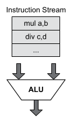
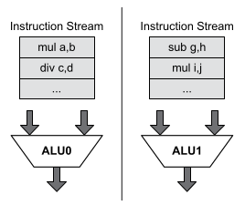
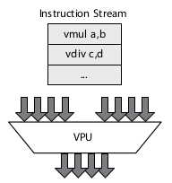
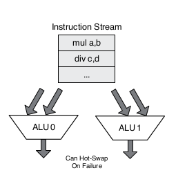
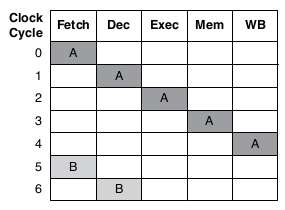
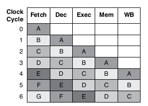
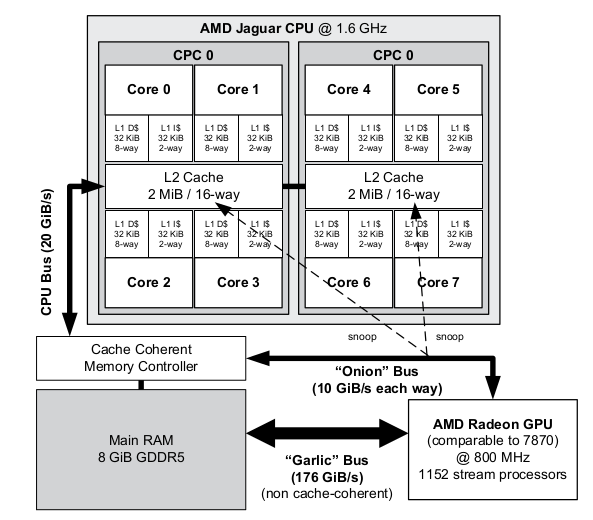
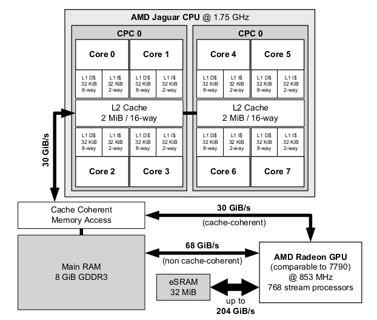

# Chapter 4

## Flynn's Taxonomy (parallel operation types)

* Single Instruction Single Data (SISD)
  * 
* Multiple Instruction Multiple Data (MIMD)
  * 
* Single Instruction Multiple Data (SIMD)
  * 
* Multiple Instruction Single Data (MISD)
  * 

## Pipelining

* Instruction level parallelism (ILP)
* Non-pipelined CPU execution:
  * 
* Non-pipelined CPU execution:
  * 

## Branch Prediction in games consoles

* PS3 Cell prcessor had poor branch prediction
* PS4 and Xbox ONE AMD Jaguar has advanced branch prediction 
  hardware

## Fast branch-avoidant code for safe floating point division 
### (handle divide-by-zero)

```
int SafeFloatDivide_pred(float a, float b, float d)
{
  // convert Boolean (b != 0.0f) into either 1U or 0U
  const unsigned condition = (unsigned)(b != 0.0f);

  // convert 1U -> 0xFFFFFFFFU
  // convert 0U -> 0x00000000U
  const unsigned mask = 0U - condition;

  // calculate quotient (will be QNaN if b == 0.0f)
  const float q = a / b;

  // select quotient when mask is all ones, or default
  // value d when mask is all zeros (NOTE: this won't
  // work as written -- you'd need to use a union to
  // interpret the floats as unsigned for masking)
  const float result = (q & mask) | (d & ~mask);
  return result;
}
```
This technique for selecting one of two possible values is
called predication or a select operation

## Very Long Instruction Word (VLIW) CPU Design

* The CPU is made up of multiple of the same compute element
  (ALU, FPU, etc.)
* Each "instruction" is comprised of 2 or more instructions,
  one for each compute element
* Example of this is PS2: The vector units VU0 and VU1 can
  dispatch two instructions per cycle each

## Multi Core CPUs

* PS4 and Xbox One both contain multicore CPUs
* Each has an accelerated processing unit (APU)
    * two quad-core AMD Jaguars in a single die with a GPU, memory controller, and video codec
    * Of the 8 total cores, 7 are available to game applications
* PS4 Architecture:
  
* XBox One Architecture:
  

## Symmetric vs Assymetric Parallelism

* Symmetric CPUs - all cores are copies of the same hardware; 
  threads run the same on each core; threads can have core affinities.
  PS4/Xbox One are examples of this, with 8 equal cores
* Asymmetric CPUs - cores can be different and are treated differently by the OS.
  A master core runs the OS and other cores are slaves. Example of this is PS3's Cell
  Broadband Engine (PPU,SPUs)

## Console Shared Libraries

* The PS4 OS uses shared libraries called PRX (name from PS3 - PPU Relocatable Executable)

## Fibers

* Provide cooperative multitasking - essentially threads except the programmer has 
  explicit control over when they are scheduled compared to other Fibers - for when
  you want to write your own job system for your program

## Mutexes vs Semaphores

* A mutex has a binary state: locked or unlocked
* A sempahore is a counter with an integer value of N, allowing a max of N
  threads to use it at once; when the semaphore value is 0 any requesting
  threads are blocked. A nonzero value means the semaphore is "signaled" (true/allow)
  and a zero value is "nonsignaled" (block/forbid)
    * A mutex can only be unlocked by the thread that locked it;
    * A semaphore can be be decremented/incremented by different threads; thus
      is more commonly used as a signal
* Semaphore example:
```
Queue g_queue;
sem_t g_semUsed; // initialized to 0
sem_t g_semFree; // initialized to 1
void* ProducerThreadSem(void*)
{
    // keep on producing forever...
    while (true)
    {
        // produce an item (can be done non-
        // atomically because it's local data)
        Item item = ProduceItem();
        // decrement the free count
        // (wait until there's room)
        sem_wait(&g_semFree);
        AddItemToQueue(&g_queue, item);
        // increment the used count
        // (notify consumer that there's data)
        sem_post(&g_semUsed);
    }
    return nullptr;
}
void* ConsumerThreadSem(void*)
{
    // keep on consuming forever...
    while (true)
    {
        // decrement the used count
        // (wait for the data to be ready)
        sem_wait(&g_semUsed);
        Item item = RemoveItemFromQueue(&g_queue);
        // increment the free count
        // (notify producer that there's room)
        sem_post(&g_semFree);
        // consume the item (can be done non-
        // atomically because it's local data)
        ConsumeItem(item);
    }
    return nullptr;
}
```

## C++ Atomic

* Protects variables without the need for a mutex via CPU specific instructions
  (normally)
```
std::atomic<float> g_data;
std::atomic_flag g_ready = false;
void ProducerThread()
{
    // produce some data
    g_data = 42;
    // inform the consumer
    g_ready = true;
}
void ConsumerThread()
{
    // wait for the data to be ready
    while (!g_ready)
    PAUSE();
    // consume the data
    ASSERT(g_data == 42);
}
```

## Testing if a lock is needed

* If it is known beforehand, due to code architecture,
  that a race condition probably won't happen, you can
  use a volatile boolean (so the compiler doesnt optimize
  it out) to assert that the overlapping
  race condition never happens. This code can then be
  defined out for production builds
* Has been used and been successful at Naughy Dog
```
class UnnecessaryLock
{
  volatile bool m_locked;
public:
  void Acquire()
  {
    // assert no one already has the lock
    assert(!m_locked);
    // now lock (so we can detect overlapping
    // critical operations if they happen)
    m_locked = true;
  }
  void Release()
  {
    // assert correct usage (that Release()
    // is only called after Acquire())
    assert(m_locked);
    // unlock
    m_locked = false;
  }
};
#if ASSERTIONS_ENABLED
#define BEGIN_ASSERT_LOCK_NOT_NECESSARY(L) (L).Acquire()
#define END_ASSERT_LOCK_NOT_NECESSARY(L) (L).Release()
#else
#define BEGIN_ASSERT_LOCK_NOT_NECESSARY(L)
#define END_ASSERT_LOCK_NOT_NECESSARY(L)
#endif

// Example usage...
UnnecessaryLock g_lock;

void EveryCriticalOperation()
{
  BEGIN_ASSERT_LOCK_NOT_NECESSARY(g_lock);
  printf("perform critical op...\n");
  END_ASSERT_LOCK_NOT_NECESSARY(g_lock);
}
```
4.10 SIMD/Vector Processing


